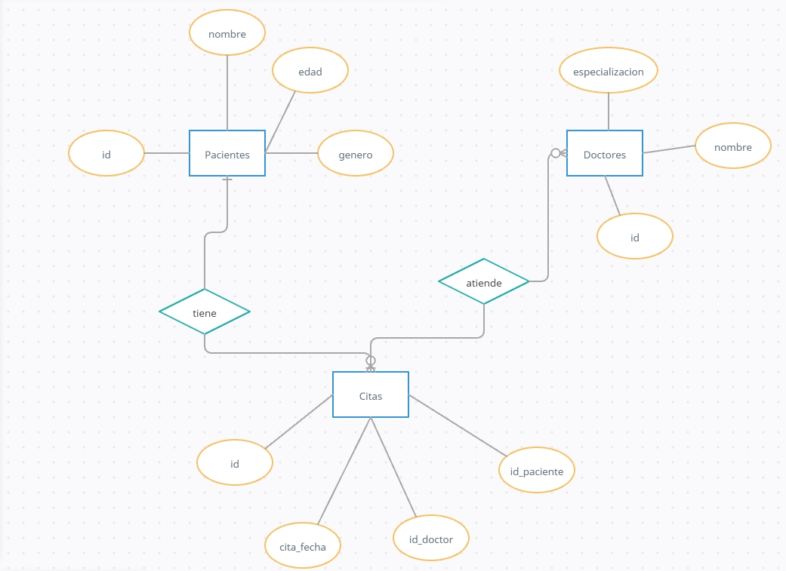
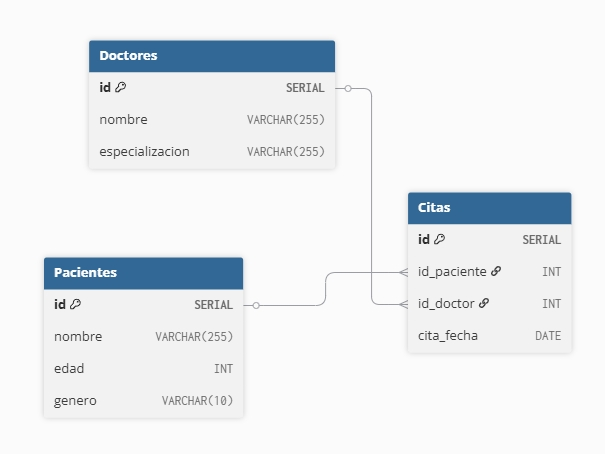
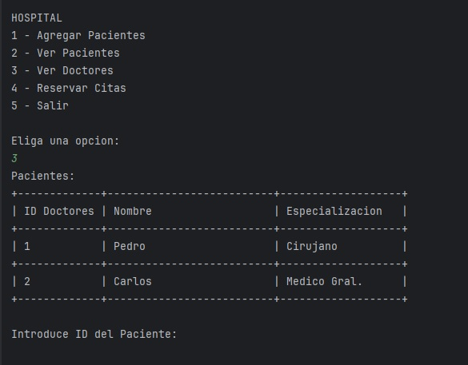
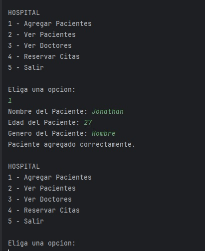
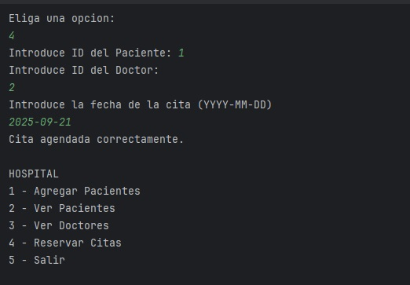

# Sistema-De-Hospital
En base a un proyecto grupal que tuve en la facultad donde creamos un servicio que interactuaba por consola para una empresa que requeria ciertas funcionalidades.
Quise crear un sistema que funciona por consola de igual pero esta vez de un sistema para hospitales
## UML

## Modelo Entidad-Relación

## Modelo Logico


# Modelo Fisico

````sql
--crear las tablas
CREATE TABLE Pacientes (
id SERIAL PRIMARY KEY,
nombre VARCHAR(255) NOT NULL,
edad INT NOT NULL,
genero VARCHAR(10) NOT NULL
);

CREATE TABLE Doctores (
id SERIAL PRIMARY KEY,
nombre VARCHAR(255) NOT NULL,
especializacion VARCHAR(255) NOT NULL
);

CREATE TABLE Citas (
id SERIAL PRIMARY KEY,
id_paciente INT NOT NULL,
id_doctor INT NOT NULL,
cita_fecha DATE NOT NULL,
FOREIGN KEY (id_paciente) REFERENCES Pacientes(id),
FOREIGN KEY (id_doctor) REFERENCES Doctores(id)
);


````

# Datos pre-cargados en la Base
````sql
-- Insertamos 2 doctores
INSERT INTO Doctores(nombre, especializacion) VALUES ('Pedro', 'Cirujano');
INSERT INTO Doctores(nombre, especializacion) VALUES ('Carlos', 'Medico Gral.');
````



# Datos para la Conexion de la bd
````java

private static final String url = "direccion_url_bd";
private static final String username = "username";
private static final String password = "password";
````

# Screen




