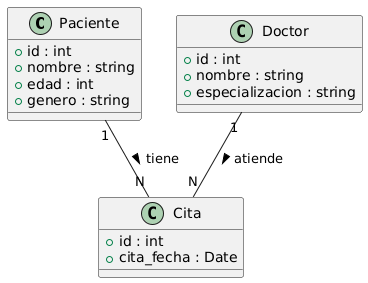

# Sistema-De-Hospital
En base a un proyecto grupal que tuve en la facultad donde creamos un servicio que interactuaba por consola para una empresa que requeria ciertas funcionalidades.
Quise crear un sistema que funciona por consola de igual pero esta vez de un sistema para hospitales
## UML

## Modelo Entidad-Relación

## Modelo Logico

